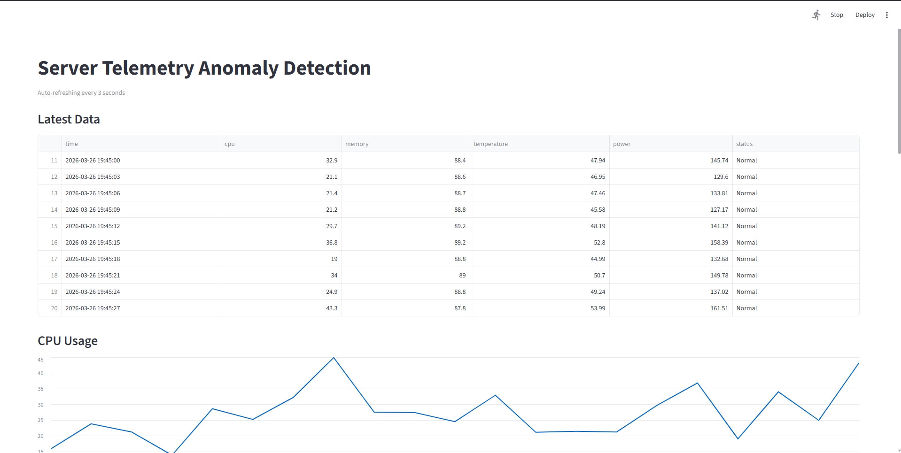
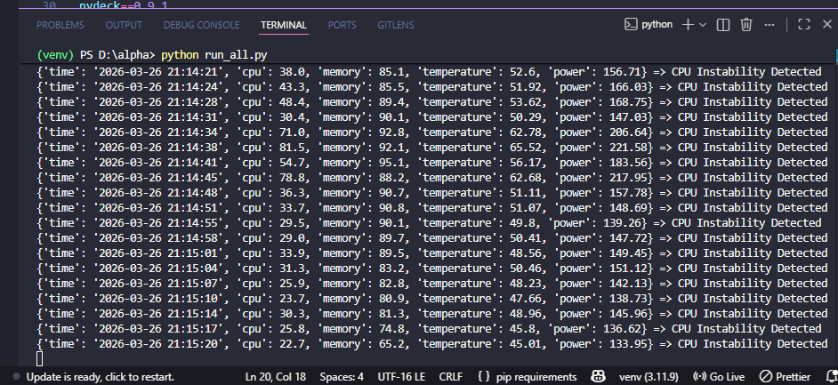

# 🚀 Server Telemetry Anomaly Detection System

> A hybrid anomaly detection system that reduces false positives in server monitoring using statistical + ML techniques.


---

## 📌 Overview

Modern data centers generate massive volumes of telemetry data (CPU, memory, temperature, power). Traditional static threshold-based monitoring often fails to capture subtle system degradations and produces excessive false positives.

This project presents a **hybrid anomaly detection system** that combines statistical methods, trend analysis, and machine learning to accurately detect both **sudden anomalies and gradual system degradation** in near real-time.

---

## 🏗️ System Architecture


> High-level architecture showing data flow from telemetry sources to anomaly detection and visualization

---

## 📸 Dashboard Preview



> Real-time monitoring dashboard displaying system metrics and anomaly detection insights

---

## ⚠️ Anomaly Detection Output



> Terminal logs showing real-time detection of CPU instability and abnormal patterns

---

## 🎯 Key Features

* 📊 Real-time telemetry monitoring (CPU, Memory, Temperature, Power)
* 🧠 Hybrid anomaly detection:

  * Rolling statistical baseline
  * Trend analysis (memory leaks, CPU instability)
  * Machine learning using Isolation Forest
* ⚙️ Hardware-aware anomaly detection:

  * Thermal anomalies
  * Power inefficiencies
* 📉 Reduced false positives using multi-layer decision logic
* 📈 Interactive dashboard built with Streamlit
* 🔁 Continuous telemetry logging

---

## 🧠 Detection Techniques

### 1. Statistical Analysis

* Rolling mean and deviation
* Detects significant deviations from recent behavior

### 2. Trend Detection

* Identifies gradual anomalies:

  * Memory leaks
  * CPU instability

### 3. Machine Learning

* Isolation Forest (unsupervised)
* Detects unknown anomaly patterns

### 4. Multi-Metric Correlation

* Detects deeper system issues:

  * High temperature + low CPU → cooling issue
  * High power + low CPU → inefficiency

---

## 📊 Results

| Metric                   | Value            |
| ------------------------ | ---------------- |
| Detection Accuracy       | *To be measured* |
| False Positive Reduction | *To be measured* |
| Detection Latency        | *To be measured* |

### 🔍 Key Observations

* Successfully detected CPU instability patterns in real-time
* Identified abnormal thermal spikes independent of CPU usage
* Reduced false alerts compared to static threshold-based methods

---

## 📂 Project Structure

```
.
├── run_all.py
├── dashboard.py
├── data/
├── modules/
├── output/
├── docs/
│   ├── architecture.png
│   ├── dashboard_main.png
│   └── anomaly_terminal.png
├── requirements.txt
└── README.md
```

---

## ⚙️ Installation

```bash
git clone https://github.com/your-username/server-telemetry-anomaly.git
cd server-telemetry-anomaly
pip install -r requirements.txt
```

---

## ▶️ Usage

Run anomaly detection:

```bash
python run_all.py
```

Run dashboard:

```bash
streamlit run dashboard.py
```

---

## 📊 Use Cases

* Early detection of hardware failures
* Identifying inefficient power usage
* Real-time server health monitoring
* Preventing downtime through proactive alerts

---

## 🚧 Future Improvements

* Deep learning models (LSTM, Autoencoders)
* Distributed monitoring system
* Alert integrations (Slack, Email)
* Docker/Kubernetes deployment

---

## 🏆 Why This Project Stands Out

* Combines **statistical + ML + domain knowledge**
* Focuses on **real-world system behavior**
* Addresses **false positives (critical industry issue)**
* Includes **live monitoring dashboard + real detection logs**

---

## 🤝 Contributing

Contributions are welcome. Fork the repository and submit a pull request.

---

